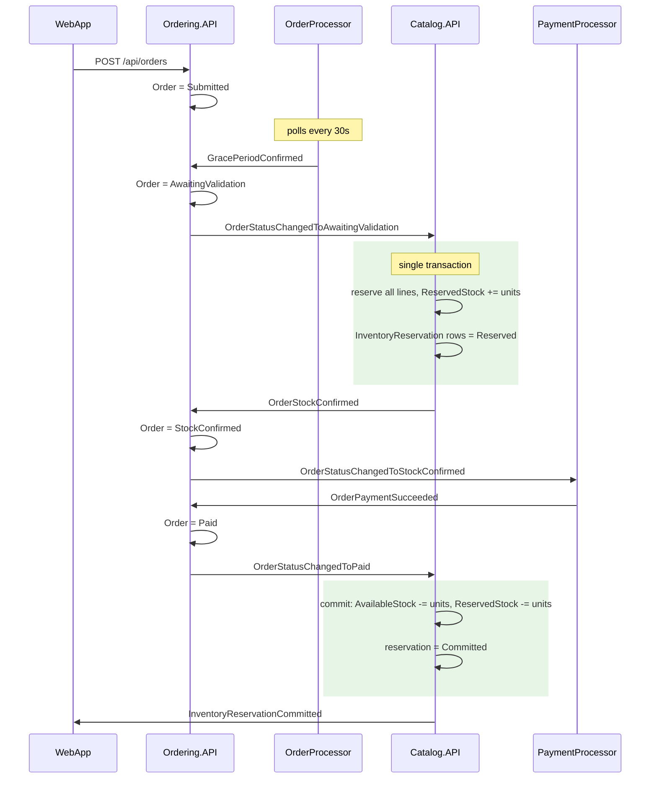
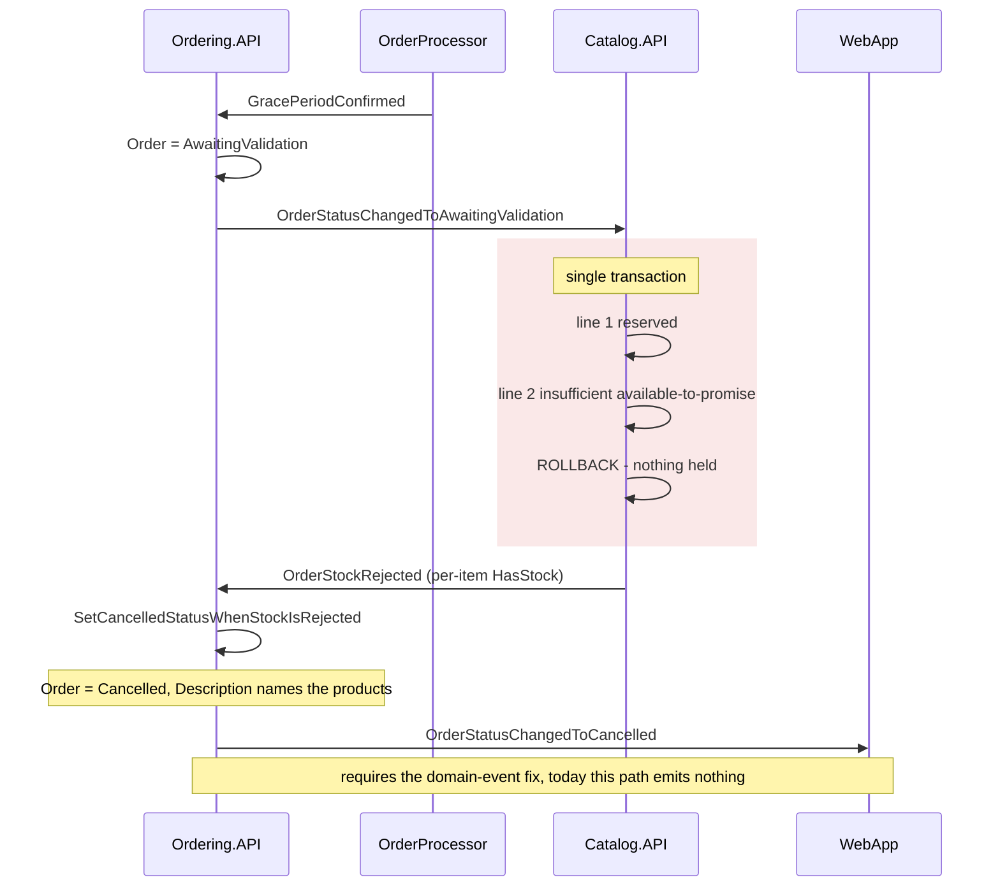
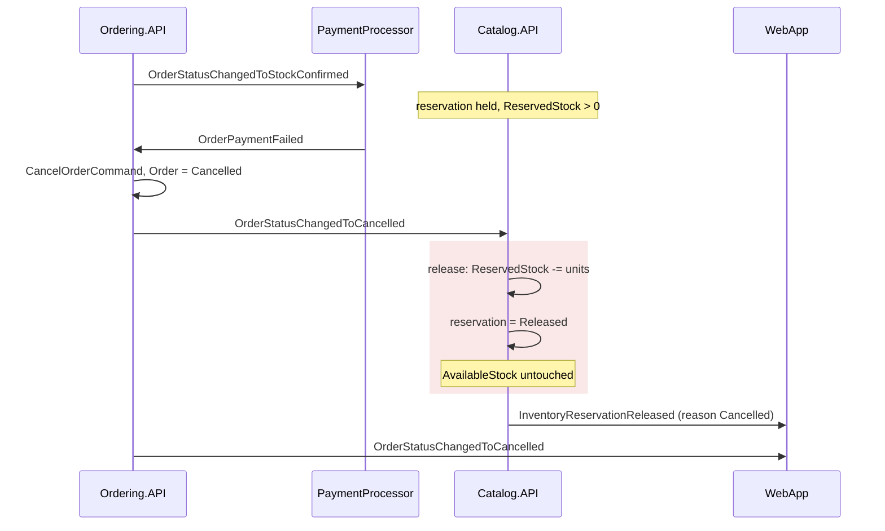

# Inventory reservation status

## Original task

I want to implement a new feature: Inventory Reservation.
The goal is:

* A customer places an order.
* Inventory is reserved before the order proceeds.
* If reservation fails, the order is rejected.
* If payment succeeds, reserved inventory becomes committed inventory.
* If payment fails or the order is cancelled, reserved inventory is released.
* The solution should follow the existing architecture and patterns already used in this repository.

Do NOT write code yet.
Based on your current understanding of the codebase, create a detailed implementation plan.
Include:
Current Flow
Describe the actual current checkout/order flow in this repository and identify where inventory reservation should be introduced.
Required Changes
For each affected service:

* Catalog
* Basket
* Ordering
* WebApp
* Background workers
* Shared contracts/events

Explain exactly what needs to change.
Data Model Changes
List:

* New fields
* New entities
* Database migrations

Use the actual existing models where possible.
Integration Events
List all new integration events.
For each event specify:

* Publisher
* Consumers
* Payload
* Purpose

Event Sequence
Provide Mermaid sequence diagrams for:

1. Successful order
2. Reservation failure
3. Payment failure and inventory release

Saga / Workflow Design
Explain whether this should be implemented using:

* existing orchestration mechanisms
* domain events
* integration events
* compensating actions

Reference existing patterns already present in the repository.
File-Level Impact Analysis
For each service list:

* Files to modify
* New files to create
* Why they need changes

Use actual file names and class names from the repository.
Incremental Delivery Plan
Break the implementation into small pull-request-sized steps.
For each step include:

* Objective
* Files affected
* Expected commit size
* Dependencies

The output should be detailed enough that each step can later be implemented independently.
Do not generate code.
Do not generate pseudocode.
Focus on architecture, affected files, dependencies, and implementation sequencing.

## Incremental Delivery Plan

I have the architecture; let me deepen on the order saga specifically, since that's where this lands. Reading the pieces I haven't yet examined closely.

Two last details I need for accurate file names and the grace-period window:

I have what I need — the order saga is fully mapped. Here's the plan.

## 1. Current Flow

The checkout path is an **event-driven saga with no orchestrator**. Verified sequence:

| # | Trigger | Component | Effect |
|---|---|---|---|
| 1 | Checkout form post | [Checkout.razor](src/WebApp/Components/Pages/Checkout/Checkout.razor) → `OrderingService` → `POST /api/orders` ([OrdersApi.cs](src/Ordering.API/Apis/OrdersApi.cs)) | `CreateOrderCommand` wrapped in `IdentifiedCommand` (`x-requestid` idempotency) |
| 2 | `CreateOrderCommandHandler` | Ordering.API | `new Order(...)` → status **Submitted**, raises `OrderStartedDomainEvent` |
| 3 | `OrderStartedDomainEvent` | `ValidateOrAddBuyerAggregateWhenOrderStartedDomainEventHandler` | Buyer + payment method verified; `OrderStartedIntegrationEvent` published |
| 4 | `OrderStartedIntegrationEvent` | Basket.API `OrderStartedIntegrationEventHandler` | Basket deleted |
| 5 | Polling, every 30s | OrderProcessor [GracePeriodManagerService](src/OrderProcessor/Services/GracePeriodManagerService.cs) + `GracePeriodOrdersRepository` — raw SQL for `OrderStatus = 'Submitted'` older than `GracePeriodTime` (**1 minute**) | `GracePeriodConfirmedIntegrationEvent` |
| 6 | `GracePeriodConfirmedIntegrationEventHandler` | Ordering.API | `SetAwaitingValidationOrderStatusCommand` → **AwaitingValidation** |
| 7 | `OrderStatusChangedToAwaitingValidationDomainEvent` | Ordering.API handler | Publishes `OrderStatusChangedToAwaitingValidationIntegrationEvent` carrying `OrderStockItems` (ProductId, Units) |
| 8 | **The stock step** | Catalog.API [OrderStatusChangedToAwaitingValidationIntegrationEventHandler](src/Catalog.API/IntegrationEvents/EventHandling/OrderStatusChangedToAwaitingValidationIntegrationEventHandler.cs) | **Read-only check** `AvailableStock >= Units` → `OrderStockConfirmedIntegrationEvent` or `OrderStockRejectedIntegrationEvent` |
| 9 | Confirmed | Ordering.API | **StockConfirmed** → `OrderStatusChangedToStockConfirmedIntegrationEvent` |
| 10 | PaymentProcessor `OrderStatusChangedToStockConfirmedIntegrationEventHandler` | Simulated via `PaymentOptions.PaymentSucceeded` | `OrderPaymentSucceededIntegrationEvent` / `OrderPaymentFailedIntegrationEvent` |
| 11 | Succeeded | Ordering.API → **Paid** → `OrderStatusChangedToPaidIntegrationEvent` | |
| 12 | Paid | Catalog.API [OrderStatusChangedToPaidIntegrationEventHandler](src/Catalog.API/IntegrationEvents/EventHandling/OrderStatusChangedToPaidIntegrationEventHandler.cs) | `CatalogItem.RemoveStock(units)` — **the only place stock ever changes** |
| 13 | Failed | `OrderPaymentFailedIntegrationEventHandler` → `CancelOrderCommand` → **Cancelled** → `OrderStatusChangedToCancelledIntegrationEvent` | Consumed only by WebApp notifications |

### The gap this feature closes

Step 8 checks stock but holds nothing; step 12 decrements it minutes later. The handler says so outright: `//we're not blocking stock/inventory`. Three concrete defects follow:

1. **TOCTOU race.** Two concurrent orders both pass validation for the last unit; both reach Paid; `RemoveStock` throws `CatalogDomainException` inside an event handler for the loser, or oversells.
2. **No release path.** `CatalogItem.AddStock` exists and is **called from nowhere**. Cancellation never returns inventory because nothing was taken.
3. **Cancellation is invisible to Catalog.** Catalog subscribes to exactly two events ([Extensions.cs](src/Catalog.API/Extensions/Extensions.cs)) — AwaitingValidation and Paid. It never learns about cancellation.

**Where reservation belongs: step 8.** That step is already the saga's designated "can we fulfil this?" gate. Replacing its read-only check with a real, persisted, transactional hold is the minimal change that respects the existing architecture. Step 12 becomes *commit* rather than *decrement*, and a new release path hangs off cancellation.

One trade-off to decide explicitly: reserving at step 8 means inventory is unprotected for the ~1–1.5 minute grace period. Reserving at step 2 instead would satisfy "reserved before the order proceeds" more literally but requires a new event out of `OrderStartedDomainEvent` and makes the grace period hold stock for every abandoned order. I recommend **step 8 for phases 1–4**, with moving the trigger earlier as an optional, separately-shippable phase 6.

---

## 2. Required Changes by Service

### Catalog.API — owns inventory, carries almost all the work

- **New aggregate behaviour on `CatalogItem`**: reserve, commit, release — modelled on the existing `RemoveStock`/`AddStock` style (guard clauses throwing `CatalogDomainException`). Introduce `ReservedStock` and derive *available-to-promise* as `AvailableStock - ReservedStock`. `AvailableStock` keeps meaning physical on-hand, so commit = decrement both; release = decrement `ReservedStock` only.
- **New entity `InventoryReservation`** — one row per (OrderId, ProductId), with status and timestamps. This is the idempotency anchor, the audit trail, and what the expiry sweeper reads.
- **Rewrite `OrderStatusChangedToAwaitingValidationIntegrationEventHandler`** to reserve **all-or-nothing inside one transaction**. On any line failing, roll back and publish `OrderStockRejectedIntegrationEvent`. This is important: it removes the partial-reservation cleanup problem entirely.
- **Rewrite `OrderStatusChangedToPaidIntegrationEventHandler`** to commit the reservation instead of calling `RemoveStock` blindly. Must be idempotent — a redelivered Paid event must not double-decrement.
- **New handler for release**: subscribe to the *existing* `OrderStatusChangedToCancelledIntegrationEvent` (requires a Catalog-local copy of the contract, per repo convention).
- **New background sweeper** to release expired reservations for abandoned orders.
- **Optimistic concurrency** on `CatalogItem` — none exists today. Npgsql's `xmin` system column as a concurrency token is the idiomatic fit and needs no schema column.
- Also: the handler currently uses `catalogContext.CatalogItems.Find(...)` synchronously in a loop and silently skips missing products (`if (catalogItem is not null)`) — meaning **an unknown product ID is treated as confirmed**. Fix that while rewriting.

### Basket.API — **no changes required**

Basket's only saga involvement is deleting the basket on `OrderStartedIntegrationEvent`. Reservation happens after the basket is already gone. I'd rather say this plainly than invent work. *Optional later:* surface available-to-promise so the basket can warn before checkout, which would need a Catalog read endpoint — separate feature, not part of this.

### Ordering.API / Ordering.Domain

Deliberately light — the saga shape doesn't change:

- `OrderStatus` gains **no** new value in phase 1. `AwaitingValidation` → `StockConfirmed` already expresses "reservation pending" → "reservation held". Adding a status is a migration plus a change to the raw SQL in `GracePeriodOrdersRepository` plus every WebApp status mapping; not worth it unless you want reservation visible to the customer.
- **Fix an existing asymmetry**: `Order.SetCancelledStatusWhenStockIsRejected` sets `OrderStatus = Cancelled` **without raising `OrderCancelledDomainEvent`**, so the stock-rejection path emits no `OrderStatusChangedToCancelledIntegrationEvent` and the customer gets no notification. With all-or-nothing reservation there's nothing to release on that path, but the missing notification is a real bug adjacent to this work.
- **New handler** for reservation expiry, cancelling the order when Catalog reports a hold has lapsed.

### PaymentProcessor — **no changes required**

It reacts to `OrderStatusChangedToStockConfirmedIntegrationEvent` and emits succeeded/failed. Both already drive commit and release. Note for testing: flip `PaymentOptions.PaymentSucceeded` to `false` in [appsettings.json](src/PaymentProcessor/appsettings.json) to exercise the release path.

### OrderProcessor — **no changes in phase 1**

Relevant only if you move reservation earlier (phase 6) or choose to host the expiry sweeper here instead of in Catalog. I recommend Catalog, since reservations live in `catalogdb` and OrderProcessor has no connection to it.

### WebApp

Display-only:
- Cancellation and rejection messages already flow through `Services/OrderStatus/`. Worth surfacing the richer rejection reason (`Order.Description` already records which products lacked stock).
- Product pages could show available-to-promise rather than raw `AvailableStock`. Optional.

### Shared contracts / EventBus

No changes to `EventBus`, `EventBusRabbitMQ`, or `IntegrationEventLogEF`. The repo's convention is **no shared contracts assembly** — each service keeps its own copy of the event records it publishes or consumes, matched by type name. New events must be duplicated into each participating project. Catalog already has an outbox (`builder.UseIntegrationEventLogs()` in `CatalogContext`), so new Catalog-published events go through `ICatalogIntegrationEventService` exactly like the existing ones.

---

## 3. Data Model Changes

### Modified: `CatalogItem` (`src/Catalog.API/Model/CatalogItem.cs`)

| Field | Type | Notes |
|---|---|---|
| `ReservedStock` | `int`, non-null, default 0 | Units held but not yet committed |

Plus three new methods alongside `RemoveStock`/`AddStock`, and a computed available-to-promise. Invariant to enforce: `0 <= ReservedStock <= AvailableStock`.

### New entity: `InventoryReservation`

| Field | Type | Notes |
|---|---|---|
| `Id` | `int` | Identity PK, matching `CatalogItem` style |
| `OrderId` | `int` | From the integration event |
| `ProductId` | `int` | FK → `CatalogItem` |
| `Units` | `int` | Units held |
| `Status` | enum (`Reserved`, `Committed`, `Released`) | Stored as int or string, consistent with `OrderStatus`'s `JsonStringEnumConverter` treatment |
| `ReservedAt` | `DateTime` (UTC) | Sweeper input |
| `ExpiresAt` | `DateTime` (UTC) | Sweeper input; derived from a new option |
| `CommittedAt` / `ReleasedAt` | `DateTime?` | Audit |

**Unique index on (`OrderId`, `ProductId`)** — this is what makes redelivered events safe, the same role the `IdentifiedCommand` table plays for the API.
Index on (`Status`, `ExpiresAt`) for the sweeper query.

### Migrations

`CatalogContext` — add to `DbSet` declarations and `OnModelCreating`:
1. **`AddInventoryReservation`** — creates the `Reservation` table with both indexes, adds `ReservedStock` to `Catalog`, configures `xmin` as concurrency token. Generated with the command documented in `CatalogContext`'s own remarks: `dotnet ef migrations add --context CatalogContext AddInventoryReservation`.

Note the repo has **four existing Catalog migrations** plus the `20260918120000_AddCatalogItemModel` you and I just landed; generate this one properly with the EF tooling so it gets its `.Designer.cs` (yours was hand-written and lacks one).

`CatalogContextSeed` needs no change — `ReservedStock` defaults to 0.

### New options

`InventoryOptions` (mirroring `CatalogOptions`, bound via `BindConfiguration`): reservation TTL, sweeper interval.

---

## 4. Integration Events

Reused unchanged (contract identical, semantics strengthened):

| Event | Publisher | Consumer | Change |
|---|---|---|---|
| `OrderStatusChangedToAwaitingValidationIntegrationEvent` | Ordering.API | Catalog.API | Now triggers a real reservation |
| `OrderStockConfirmedIntegrationEvent` | Catalog.API | Ordering.API | Now means "reserved", not "looked available" |
| `OrderStockRejectedIntegrationEvent` | Catalog.API | Ordering.API | Now means "could not reserve" |
| `OrderStatusChangedToPaidIntegrationEvent` | Ordering.API | Catalog.API | Now triggers commit |
| `OrderStatusChangedToCancelledIntegrationEvent` | Ordering.API | **Catalog.API (new)**, WebApp | Now triggers release |

Genuinely new:

**`InventoryReservationCommittedIntegrationEvent`**
- Publisher: Catalog.API, after a successful commit
- Consumers: WebApp (`OrderStatusNotificationService`); optionally Ordering.API for audit
- Payload: `OrderId`, list of (ProductId, Units), `CommittedAt`
- Purpose: makes "reserved became committed" observable rather than a silent DB mutation. Closes the saga's happy path.

**`InventoryReservationReleasedIntegrationEvent`**
- Publisher: Catalog.API, after release (cancellation *or* expiry)
- Consumers: WebApp; optionally Ordering.API
- Payload: `OrderId`, list of (ProductId, Units), `ReleasedAt`, reason (`Cancelled` / `Expired`)
- Purpose: confirms the compensating action completed. Without it, a failed release is invisible and inventory silently leaks.

**`InventoryReservationExpiredIntegrationEvent`**
- Publisher: Catalog.API sweeper
- Consumer: **Ordering.API** — new handler issuing `CancelOrderCommand`
- Payload: `OrderId`, `ExpiredAt`
- Purpose: an order whose hold lapsed must not proceed to payment. This is the only new event that *drives* a state change rather than reporting one.

Each needs a copy in every participating project, per repo convention.

---

## 5. Event Sequence

### Successful order

### Reservation failure

### Payment failure and release

---

## 6. Saga / Workflow Design

**Use the existing choreographed saga. Do not introduce an orchestrator.**

The repo has no saga framework — no MassTransit state machines, no Dapr workflows, no process manager. It composes four mechanisms, and reservation fits all four without anything new:

1. **Domain events via MediatR** (`AddDomainEvent` on `Entity`, dispatched after `SaveChanges`) — stay inside Ordering for aggregate-local consequences.
2. **Integration events via RabbitMQ** (`IEventBus`, `IIntegrationEventHandler<T>`) — cross-service steps. Reservation is cross-service, so this is the right level.
3. **Transactional outbox** (`IntegrationEventLogEF`, `SaveEventAndCatalogContextChangesAsync` then `PublishThroughEventBusAsync`) — already used by Catalog's existing handler. **Critical**: the reservation write and the confirm/reject event must share one transaction via this existing mechanism, or you get held stock with no event, or an event with no hold.
4. **Compensating actions** — release *is* the compensation, triggered by cancellation. This is textbook choreographed saga compensation and matches how the codebase already handles `OrderPaymentFailed` → `CancelOrderCommand`.

Two properties you must design for, because at-least-once delivery is guaranteed by the transport:

- **Idempotency** — the unique index on (OrderId, ProductId) plus the reservation `Status` makes every handler a safe no-op on redelivery. Precedent: `IdentifiedCommandHandler` in Ordering.
- **Concurrency** — the real fix for overselling. `xmin` optimistic concurrency plus retry on `DbUpdateConcurrencyException`; on exhausted retries, reject rather than oversell.

The timeout/expiry sweeper follows the `GracePeriodManagerService` precedent exactly: a polling `BackgroundService` with an interval from options and a thin repository. That's the repo's established answer to "something must happen after a delay."

---

## 7. File-Level Impact Analysis

### Catalog.API

**Modify**
| File | Why |
|---|---|
| `Model/CatalogItem.cs` | `ReservedStock`, reserve/commit/release behaviour, available-to-promise |
| `Infrastructure/CatalogContext.cs` | `DbSet<InventoryReservation>`, apply new configuration |
| `Infrastructure/EntityConfigurations/CatalogItemEntityTypeConfiguration.cs` | `ReservedStock` column, `xmin` concurrency token |
| `IntegrationEvents/EventHandling/OrderStatusChangedToAwaitingValidationIntegrationEventHandler.cs` | Read-only check → transactional all-or-nothing reservation; fix the unknown-product-passes bug |
| `IntegrationEvents/EventHandling/OrderStatusChangedToPaidIntegrationEventHandler.cs` | `RemoveStock` → idempotent commit |
| `Extensions/Extensions.cs` | Two new `AddSubscription<>` calls, register sweeper + repository + `InventoryOptions` |
| `Apis/CatalogApi.cs` | Optional: expose available-to-promise / reservation lookup |
| `Catalog.API.json`, `Catalog.API_v2.json` | Build-regenerated if the API surface changes |

**Create**
| File | Why |
|---|---|
| `Model/InventoryReservation.cs` | New entity |
| `Model/ReservationStatus.cs` | Enum |
| `Infrastructure/EntityConfigurations/InventoryReservationEntityTypeConfiguration.cs` | Table, unique index, sweeper index |
| `Infrastructure/Migrations/*_AddInventoryReservation.cs` (+ `.Designer.cs`) | EF-generated |
| `Services/IInventoryReservationService.cs` + `InventoryReservationService.cs` | Reserve/commit/release orchestration, transaction + retry — keeps handlers thin, matching `CatalogAI`/`CatalogIntegrationEventService` style |
| `Services/ReservationExpiryService.cs` | `BackgroundService` sweeper, modelled on `GracePeriodManagerService` |
| `Services/IReservationRepository.cs` + implementation | Sweeper queries |
| `InventoryOptions.cs` | TTL + interval, mirroring `CatalogOptions` |
| `IntegrationEvents/EventHandling/OrderStatusChangedToCancelledIntegrationEventHandler.cs` | Release on cancellation |
| `IntegrationEvents/Events/OrderStatusChangedToCancelledIntegrationEvent.cs` | Local contract copy |
| `IntegrationEvents/Events/InventoryReservation{Committed,Released,Expired}IntegrationEvent.cs` | New events |

### Ordering.API / Ordering.Domain

**Modify**
| File | Why |
|---|---|
| `Ordering.Domain/.../OrderAggregate/Order.cs` | Raise `OrderCancelledDomainEvent` from `SetCancelledStatusWhenStockIsRejected` |
| `Ordering.API/Extensions/Extensions.cs` | Subscribe to `InventoryReservationExpiredIntegrationEvent` |

**Create**
| File | Why |
|---|---|
| `Application/IntegrationEvents/EventHandling/InventoryReservationExpiredIntegrationEventHandler.cs` | Cancel order on lapsed hold; mirrors `OrderPaymentFailedIntegrationEventHandler` |
| `Application/IntegrationEvents/Events/InventoryReservationExpiredIntegrationEvent.cs` | Local contract copy |

### WebApp

**Modify** — `Services/OrderStatus/OrderStatusNotificationService.cs` and `Extensions/Extensions.cs` (subscriptions) if you surface commit/release notifications; `Components/Pages/Item/ItemPage.razor` if you show available-to-promise.
**Create** — `Services/OrderStatus/IntegrationEvents/Events/InventoryReservation{Committed,Released}IntegrationEvent.cs`.

### Basket.API, PaymentProcessor, OrderProcessor, AppHost

No changes. Catalog already has `catalogdb` and `eventbus` references in [AppHost/Program.cs](src/eShop.AppHost/Program.cs), so the sweeper needs no new wiring.

### Tests

**Modify** — `tests/Catalog.FunctionalTests/CatalogApiTests.cs`, `tests/Ordering.UnitTests/` (Order aggregate transitions), `tests/Application.UnitTests/`.
**Create** — `tests/Catalog.UnitTests/` (doesn't exist yet; needed for `CatalogItem` reserve/commit/release invariants and a concurrency test) and a reservation-lifecycle functional test. Add any new project to [eShop.slnx](eShop.slnx) **and** [eShop.Web.slnf](eShop.Web.slnf), or CI won't build it.

---

## 8. Incremental Delivery Plan

Seven PRs. Steps 1–2 are pure additions behind no behaviour change, so they're safe to merge early.

### PR 1 — Inventory domain model and schema
- **Objective**: `ReservedStock`, `InventoryReservation`, reserve/commit/release behaviour with invariants, migration, concurrency token. Nothing calls it yet.
- **Files**: `CatalogItem.cs`, new `InventoryReservation.cs` + `ReservationStatus.cs`, both entity configurations, `CatalogContext.cs`, new migration, new `tests/Catalog.UnitTests/`, `eShop.slnx` + `eShop.Web.slnf`
- **Size**: ~400 lines, mostly generated migration + tests
- **Depends on**: nothing
- **Note**: fully behaviour-neutral; the column exists and stays 0

### PR 2 — Reservation service
- **Objective**: `InventoryReservationService` with transactional all-or-nothing reserve, idempotent commit, idempotent release, concurrency retry. Unit tested, still unwired.
- **Files**: `Services/IInventoryReservationService.cs` + impl, `InventoryOptions.cs`, `Extensions.cs` (registration), `tests/Catalog.UnitTests/`
- **Size**: ~350 lines
- **Depends on**: PR 1

### PR 3 — Reserve on validation *(first behaviour change)*
- **Objective**: replace the read-only check with real reservation; fix the unknown-product bug. Confirm/reject contracts unchanged, so Ordering needs no change.
- **Files**: `OrderStatusChangedToAwaitingValidationIntegrationEventHandler.cs`, `tests/Catalog.FunctionalTests/CatalogApiTests.cs`
- **Size**: ~150 lines
- **Depends on**: PR 2
- **Risk**: without PR 4, a reserved-then-paid order double-counts — PR 3 and 4 should land together or in immediate succession

### PR 4 — Commit on payment
- **Objective**: Paid handler commits the reservation idempotently instead of calling `RemoveStock`; publish `InventoryReservationCommittedIntegrationEvent`.
- **Files**: `OrderStatusChangedToPaidIntegrationEventHandler.cs`, new committed event, functional tests
- **Size**: ~150 lines
- **Depends on**: PR 3

### PR 5 — Release on cancellation
- **Objective**: Catalog subscribes to `OrderStatusChangedToCancelledIntegrationEvent` and releases; publish `InventoryReservationReleasedIntegrationEvent`. Fix `SetCancelledStatusWhenStockIsRejected` to raise its domain event.
- **Files**: new Catalog cancellation handler + local event copy, released event, `Catalog.API/Extensions/Extensions.cs`, `Ordering.Domain/.../Order.cs`, `tests/Ordering.UnitTests/`, functional tests
- **Size**: ~250 lines
- **Depends on**: PR 4
- **Test**: flip `PaymentOptions.PaymentSucceeded` to `false`

### PR 6 — Expiry sweeper
- **Objective**: release abandoned holds; publish `InventoryReservationExpiredIntegrationEvent`; Ordering cancels on it.
- **Files**: `ReservationExpiryService.cs`, reservation repository, expired event (Catalog + Ordering copies), new Ordering handler, both `Extensions.cs`, `appsettings.json`
- **Size**: ~300 lines
- **Depends on**: PR 5
- **Note**: the only PR that closes the abandoned-order leak; everything before it depends on cancellation actually firing

### PR 7 — Customer-visible state
- **Objective**: surface available-to-promise and reservation outcomes in the UI; richer rejection messaging from `Order.Description`.
- **Files**: `WebApp/Services/OrderStatus/*`, `WebApp/Extensions/Extensions.cs`, `ItemPage.razor`, `CatalogApi.cs` + regenerated OpenAPI, e2e spec
- **Size**: ~250 lines
- **Depends on**: PR 4 (functionally independent of 5–6)

**Optional PR 8 — reserve at submission.** Move the trigger from `AwaitingValidation` to `OrderStartedDomainEvent` so nothing is unprotected during the grace period. Touches Ordering's domain event handlers and possibly `GracePeriodOrdersRepository`'s raw SQL. Defer until 1–7 are proven; it's a product decision about whether abandoned orders should hold stock.

